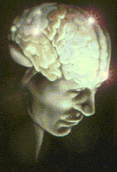

**Controlling a human being with a game controller: it seems crazy, right? You're not dreaming: just two electrodes and a small device can help you take control of the balance of your worst enemies!**

The ***G**énialissime **V**ecteur de **S**ensations (**GVS**)* is a **Galvanic Vestibular Stimulation** device built with analog electronics, designed to induce balance and orientation sensations through controlled current stimulation. 

<p align="center">
  
  
  
</p>

<h1 align="center">Génialissime Vecteur de Sensations</h1>

<h5 align="center"><a href="https://milovan.me">milovan.me</a></h5>

> [!CAUTION]
> This device can deliver **electrical current** to **a human skull**. By using this project, you agree that you are **solely responsible** for any accident, dizziness, nausea, or existential crises that may occur. I'm **not** a doctor: do not use it if you don't know what you're building and doing. Max current is hardware-limited to 5mA, but that's still enough to ruin your afternoon.
> 
> **Build and use it at your own risk.**

## 🧠 What is GVS?

> #### Check out the [detailed documentation](./docs/gvs.md).

**G**alvanic **V**estibular **S**timulation (**GVS**) is the process of sending electric messages (*in this project, a low-level DC current*) to a nerve in **the vestibular system**, located in the ear, that maintains balance. We "access" the vestibular system through **the mastoid process**, a conical projection forming a bony prominence behind and below the ear.

### Vestibular system

The vestibular system is a sensory organ, constitutive of the inner ear, that creates **the sense of balance and spatial orientation** for the function of coordinating movement with balance. This organ is present in most mammals.

Troubles of the vestibular system can lead to **dizziness**: this device exploits this by applying **a controlled DC current to the mastoid process**, artificially triggering the vestibular nerve and **inducing balance and orientation sensations**.

## ⚙️ Circuit Design

> #### Check out the [detailed documentation](./docs/circuit.md).

The circuit is a **transconductance amplifier**: it converts an input voltage (the joystick position) into a controlled output current through the electrodes. The core of the circuit is an **improved Howland current source**, preceded by an input signal generation stage and followed by a push-pull output stage with hardware current limiting.

### Signal flow

The signal flows as follows:

1. A **stable `±2.5 V` supply** is generated from the `±9 V` rails
2. The **joystick position** sets a DC bias between `-2.5 V` and `+2.5 V` through a potentiometer
3. A **fade-in/fade-out RC filter** smooths abrupt transitions
4. A **Wien oscillator** generates a `300 mVp` sine wave at `1.5 Hz`
5. Both signals are **summed and inverted** before entering the Howland stage
6. The **Howland current source** converts the input voltage to a proportional current
7. A **push-pull stage** boosts output compliance and current capability
8. A **hardware current limiter** caps the output at `3-5 mA`
9. Current flows through the **electrodes** placed on the mastoid processes

## 🔒 Safety

> #### Check out the [detailed documentation](./docs/safety.md).

This device delivers a controlled electrical current directly to the human skull: **this is not a toy!** Hardware protections are in place (current limiter, emergency stop), but they are not a substitute for **testing**, **electrode placement**, and **common sense**.

## Documentation
### Find your happiness:
- 🧠 [What is GVS?](./docs/gvs.md): Vestibular system, physiological effects and stimulation principles
- ⚙️ [Circuit Design](./docs/circuit.md): Improved Howland current source, push-pull follower and component selection
- 🔒 [Safety](./docs/safety.md): Current limits, galvanic isolation, emergency switch and build protocol
- 🧪 [Simulation](./docs/simulation.md): LTspice models, transient analysis and scenarios

## Repository Structure
```
├── spice/           # SPICE schematic and simulation files
├── docs/            # Documentation, conception notes
└── assets/          # Images, schematics and illustrations
```
