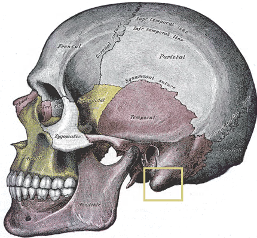
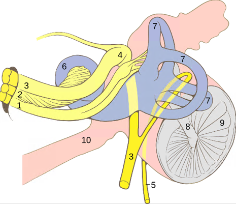

# 🧠 What is GVS?

## Overview

**G**alvanic **V**estibular **S**timulation (**GVS**) is the process of sending electric messages (*in this project, a low-level DC current*) to a nerve in **the vestibular system**, located in the ear, that maintains balance. We "access" the vestibular system through **the mastoid process**, a conical projection forming a bony prominence behind and below the ear.

  
    
  <a><i><b>Figure: </b>Mastoid process</i></a>

### Vestibular system

The vestibular system is a sensory organ, constitutive of the inner ear, that creates **the sense of balance and spatial orientation** for the function of coordinating movement with balance. This organ is present in most mammals.

  
    
  <a><i><b>Figure: </b>Vestibular system (Middle and inner ear structure)</i></a>

The brain uses information from the vestibular system in the head (sensorial signals) to enable **an understanding of the body's dynamics and kinematics**.

These signals are sent to the neural structures responsible for postural control, coordinating the body's position and movement within its environment.

Troubles of the vestibular system can lead to **dizziness**: this device exploits this by applying **a controlled DC current to the mastoid process**, artificially triggering the vestibular nerve and **inducing balance and orientation sensations**.

## State of the Art

GVS has been investigated across three main domains:

**Biomedical & rehabilitation**: Used to probe vestibular function in clinical research, and more recently to help patients relearn balance after injury or neurological conditions by tapping into the brain's sense of orientation (University of Chicago, 2025).

**Pilot training**: Spatial disorientation (SD) remains the leading cause of Class A mishaps in the U.S. Navy. Since static flight simulators provide no vestibular stimulation, GVS has been proposed as a low-cost solution to replicate vestibular illusions (graveyard spin, Coriolis...) in a grounded simulator, allowing pilots to safely experience and learn to recover from disorienting events (Allred et al., 2024).

**Entertainment & VR**: Synchronized with visual stimuli, GVS enhances immersion by making users physically feel motion in virtual environments. Video games, film, and VR headsets are some interesting integration vectors.

*This project falls into the third category; with a joystick as input.*
