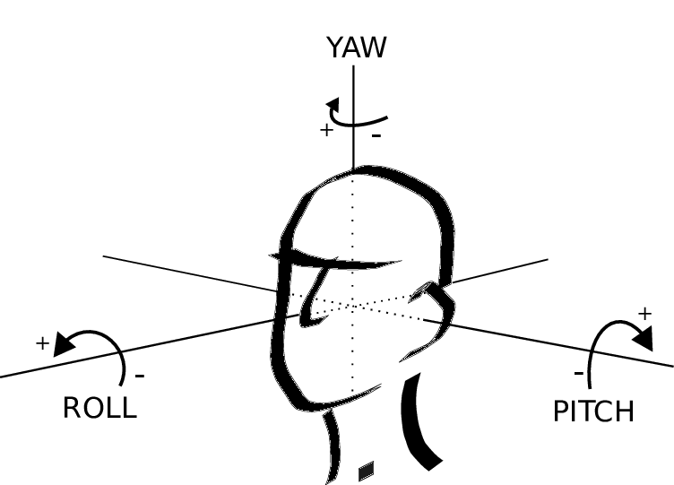

# 🧠 What is GVS?

## Overview

**G**alvanic **V**estibular **S**timulation (**GVS**) is the process of sending electric messages (*in this project, a low-level DC current*) to a nerve in **the vestibular system**, located in the ear, that maintains balance. We "access" the vestibular system through **the mastoid process**, a conical projection forming a bony prominence behind and below the ear.

  
    
  <a><i><b>Figure: </b>Mastoid process</i></a>

### Vestibular system

The vestibular system is a sensory organ, constitutive of the inner ear, that creates **the sense of balance and spatial orientation** for the function of coordinating movement with balance. This organ is present in most mammals.

  
    
  <a><i><b>Figure: </b>Vestibular system (Middle and inner ear structure)</i></a>

The brain uses information from the vestibular system in the head (sensorial signals) to enable **an understanding of the body's dynamics and kinematics**.

These signals are sent to the neural structures responsible for postural control, coordinating the body's position and movement within its environment.

Troubles of the vestibular system can lead to **dizziness**: this device exploits this by applying **a controlled DC current to the mastoid process**, artificially triggering the vestibular nerve and **inducing balance and orientation sensations**.

## State of the Art

GVS has been investigated across three main domains:

**Biomedical & rehabilitation**: Used to probe vestibular function in clinical research, and more recently to help patients relearn balance after injury or neurological conditions such as Parkinson's disease and stroke, by tapping into the brain's sense of orientation ([Mahmud et al., 2022](https://pubmed.ncbi.nlm.nih.gov/36116217/)). [[archive](https://web.archive.org/web/20260628224816/https://pubmed.ncbi.nlm.nih.gov/36116217/)]

**Pilot training**: Spatial disorientation (SD) remains the leading cause of Class A mishaps in the U.S. Navy. Since static flight simulators provide no vestibular stimulation, GVS has been proposed as a low-cost solution to replicate vestibular illusions (graveyard spin, Coriolis...) in a grounded simulator, allowing pilots to safely experience and learn to recover from disorienting events ([Allred et al., 2024](https://asma.kglmeridian.com/view/journals/amhp/95/7/article-p390.xml)). [[archive](https://web.archive.org/web/20260628193340/https://asma.kglmeridian.com/view/journals/amhp/95/7/article-p390.xml)]

**Entertainment & VR**: Synchronized with visual stimuli, GVS enhances immersion by making users physically feel motion in virtual environments. Video games, film, and VR headsets are some interesting integration vectors ([University of Chicago, 2025](https://cs.uchicago.edu/news/redirecting-hands-in-virtual-reality-with-galvanic-vestibular-stimulation-uchicago-lab-to-present-first-of-its-kind-work-at-uist-2025/)). [[archive](https://web.archive.org/web/20260628193641/https://cs.uchicago.edu/news/redirecting-hands-in-virtual-reality-with-galvanic-vestibular-stimulation-uchicago-lab-to-present-first-of-its-kind-work-at-uist-2025/)]

*This project falls into the third category; with a joystick as input.*

## Polarity Effects

In the binaural bipolar configuration (one electrode behind each mastoid), reversing the current polarity reverses the perceived direction of tilt.

| Polarity | Cathode side | Anode side | Perceived effect |
|----------|-------------|------------|-----------------|
| ➡ | Left | Right | Tilt to the left |
| ⬅ | Right | Left | Tilt to the right |

The cathode (negative) depolarizes the vestibular afferents on its side, while the anode (positive) hyperpolarizes those on the opposite side; mimicking the neural signal of an actual physical tilt.

### Axes of Stimulation

The binaural bipolar montage primarily induces a sensation of **roll**: a lateral tilt to the left or right, as if leaning toward one shoulder. This is the main useful effect for balance perturbation applications like this project. A small **yaw** component (a sensation of rotating on oneself) is also produced, as a side effect of the geometry of the semicircular canals in the skull, which are not perfectly aligned with the stimulation axis.

  
    
  <a><i><b>Figure: </b>Principal axis: Pitch, yaw, and roll</i></a>

Pitch sensations are **not achievable** with this two-electrode configuration: four-electrode montages are required to stimulate all three axes.

## Stimulation Parameters

| Parameter | Typical range | This project |
|-----------|--------------|--------------|
| Current | 1 – 5 mA | ≤ 5 mA (hardware-limited) |
| Waveform | DC / low-frequency | DC bias + 1.5 Hz sine |
| Electrode size | 30 – 50 mm diameter | / |
| Electrode placement | Mastoid processes | Mastoid processes |

Current amplitude is the main control variable: higher current produces stronger tilt sensations. Below 1 mA, effects are generally subthreshold and imperceptible. Above 3.5 mA, motion sickness symptoms have been reported during prolonged exposure ([Allred et al., 2024](https://asma.kglmeridian.com/view/journals/amhp/95/7/article-p390.xml)). [[archive](https://web.archive.org/web/20260628193340/https://asma.kglmeridian.com/view/journals/amhp/95/7/article-p390.xml)]

> [!WARNING]
> While 5 mA is the absolute hardware limit, it may be too intense for
> comfortable use. For the final build, I recommend capping the current
> at **3 mA** to stay well below the threshold where motion sickness
> symptoms have been reported in the literature.

The input signal is the sum of two components: a low-frequency sine wave (300 mVp @ 1.5 Hz) generated by a Wien oscillator, and a DC bias (-2.5 V to +2.5 V) set by the joystick axis through a potentiometer. This combined signal drives the Howland current source (see [Circuit documentation](./circuit.md)).
